# Assignment01: Heuristic Evaluation
##### Anjenica (Nikki) Ramos
##### DH 150: User Experience Design, Spring 2020 - Prof. Cho

#### Working Interest: Coronavirus Resource Site Improvement
When deciding what kind of public websites/apps I wanted to evaluation, what mattered most to me was its relevance and utility. Inspired by current events, I'm interested in focusing my heuristic evaluation here, as well as my overall project, on government resources in relation to the ongoing COVID-19 pandemic. My first site of choice is the Coronavirus information site for the World Health Organization (WHO), serving as as a trustworthy international source on COVID-19. The second is the state of California's re-employment initiative, which seeks to find jobs for those whose employments were affected by the pandemic.
In real time, we are seeing the way information (and misinformation, and confusion, and hysteria) influence public action. I believe the manner this information is conveyed its also key in making sure it is effective and enacted. In this way, UX design plays an underlyingly pivotal role in the connection of the public to information to a course of action. Especially in quarantine conditions where human interaction is restricted, it is especially hard to seek help from others. As many are left to their own devices, we are increasingly reliant on the internet to navigate this critical time. Therefore, it is an underlying urgency that we ensure these online resources' usability. 

#### *Evaluation Severity Scale:*
##### 1 = Cosmetic problem only: need not be fixed unless extra time is available on project
##### 2 = Minor usability problem: fixing this should be given low priority
##### 3 = Major usability problem: important to fix, so should be given high priority

## Site01: [World Health Organization: COVID-19 Pandemic](https://www.who.int/emergencies/diseases/novel-coronavirus-2019)

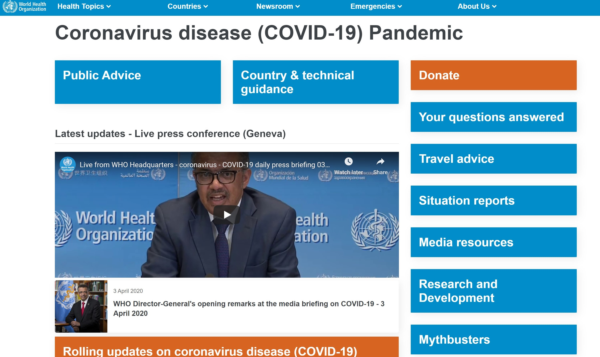

### 1. Visibility of System Status
A hotizontal section of the site is dedicated to statistics of the current outbreak, displaying the number of confirmed cases (presumably worldwide, since it doesn't explicitly say), confirmed deaths (again, assumed to be worldwide), and the count of countries infected. What's nice in this section is they include in a smaller, undistracting font, when these values are updated (which is within the day of when I viewed it). Since users can see these are quite current, it increases the reliability of the site. I would just specify that these are worldwide demographics. 
   ##### Severity: 1

This is minor, but *most* clickable buttons and link on the site are 'highlighted' as an underline of the words or symbols you're hovering over. However, this is not the case for all links, making it uncertain which things are clickable to navigate to other pages, as well as which texts are just are colored a certain way for stylistic purposes or because they indicate they're a link or just supporting text. 
   ##### Severity: 1

### 2. Match Between System + Real World
The WHO site does a good job in terms of their vocabulary use and understandability of their information. When it comes to explanatory information, like basic protective measures, they give concise instructions in laymans terms. They also have accompanying informational videos for some items.
   ##### ex. About Maintain social distancing:
   ###### "Maintain at least 1 metre (3 feet) distance between yourself and anyone who is coughing or sneezing.
   ###### Why? When someone coughs or sneezes they spray small liquid droplets from their nose or mouth which may contain virus. If you are too close, you can breathe in the droplets, including the COVID-19 virus if the person coughing has the disease."
I also notice that the site does well to explain acronyms and list the formal codes of medical conditions.
   ##### ex. A description of an online training resource on SARS:
   ###### "This training is intended for clinicians who are working in intensive care units (ICUs) in low and middle-income countries and managing adult and pediatric patients with severe forms of acute respiratory infection (SARI), including severe pneumonia, acute respiratory distress syndrome (ARDS), sepsis and septic shock. It is a hands-on practical guide to be used by health care professionals involved in clinical care management during outbreaks of influenza virus (seasonal) human infection due avian influenza virus (H5N1, H7N9), MERS-CoV, COVID-19 or other emerging respiratory viral epidemics." 
This is critical since a countless people will be viewing this site, all coming from a range of background expertise. Certain areas of the site are intended for the more general public ("What is a coronavirus?", "How to protect yourself?"), while others are for more technical infomation ("Clinical Trials Registry Platform", "Database of Publications"), and the language used in these areas matches expected levels of understanding. 
   ##### Severity: n/a - good as is

### 3. User Control + Freedom

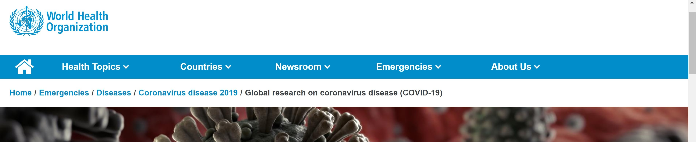
At the top of each page, the site displays the page path in respect to the WHO's main page, which is helpful in keeping in mind what areas and categories of the site you are on as you delve deeper into its contents. Each page 'outside' of the one you're currently on is hyperlinked as well, which provides an easy exit and way to backtrack your steps, as you can return to the previous page by clicking on the parent link. My only critique would be that, since some sites are linked to other areas of the WHO site, it would be beneficial to standardize this page path in respect to the coronavirus site instead of the page paths of other areas. (ex. while x article is also in /Newsroom/Articles/2019/x, it would be better if the path is shown as the one relevant to how the user got there, i.e. COVID-19 Home/Media Resources/x)
##### Severity: 2

### 4. Consistency + Standards
Much of the problems with the WHO COVID-19 site is its interface in general: the site's layout, how information is organized, and the lack of internal consistency throughout. For one, the "Your questions answered" bar at top of the page opens a tab headed as ["Q&A on coronaviruses (COVID-19)"] (https://www.who.int/news-room/q-a-detail/q-a-coronaviruses), which features a list of questions on an accordion list whose answers can be displayed when clicked on an expanded. It'd be nice if there was just consistency between the names of these two pages, as the Q&A area is actually not a part of the WHO's coronavirus sites, but its Newsroom tab. While this is just one example, I found this to be the case for various links, where the COVID-19 main page links to different areas of the WHO's site. It just makes you second guess whether it's *supposed* to lead here, since names and page formats don't line up. 
   ##### Severity: 3

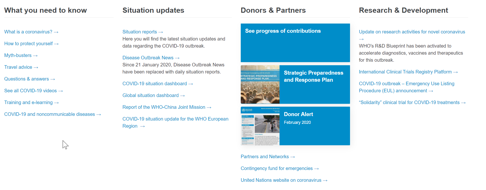
Also, there is a large discrepancy between how informaiton is categorized at the top of the page versus the bottom. The top of the landing page displays the various tabs to click on, while the bottom of the page features 4 columns with links, which feature open to much of the same pages some of the time, while others don't. How they re-organize the 10 tabs into 4 options also seems arbitrary, as a several top page bars are chunked under "Your questions answered," while the "Research and Developments" bar gets its own list despite it being probably less popular. Another case, there is a ["Your questions answered"](https://www.who.int/news-room/q-a-detail/q-a-coronaviruses) bar at the top of the page, while the bottom's "What you need to know" list displays a ["Questions & answers"](https://www.who.int/news-room/q-a-detail) link, which leads to completely different Q&A page that is barely related to COVID-19 at all, since it seems to be a general masterlist of questions for the WHO (with infinite scroll and no topic-based organization), with only a couple questions being relevant to COVID-19. 
   ##### Severity: 3

The WHO has the signature colors of a bright blue and white for their branding, which is evident in the site. This is also used on the category bars on the top of the screen. However, some bars are orange instead, which may have been done to draw attention to those specific tabs, but it is unclear as to what system is used to distinguish what gets what color and why.
   ##### Severity: 2

In relation, what topics/categories were chosen to be bars also seems somewhat arbitrary. These buttons would be a good area to add some icons to the side of the word explanations of these buttons, to make it a bit easier to glance at a particular bar of interest as opposed to reading through this list (which is not alphabetized or seem to be displayed in any particular order). This would also related to heuristic no. 7 of efficiency as well as no. 8 design. Additionally, some of these bars open new tabs, while others change the tab you're currently on.
   ##### Severity: 2

Also, more cosmetic, the site has various inconsistencies in capitalization and symbol use with (and vs. &). For example, a category bar as "Country & technical guidance", "Media resources", "Your questions answered", but also "Research and Development" and "Public Advice" with both words capitalized and spelled out 'and'. 
   ##### Severity: 1

### 5. Error Prevention 
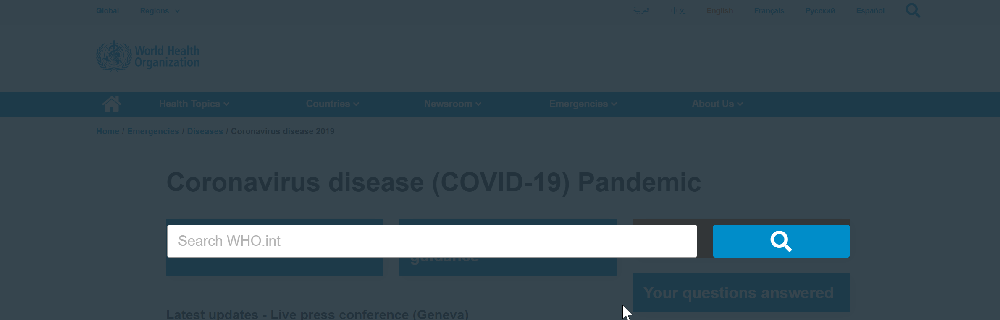
Since much of what the user does on the WHO COVID-19 site is seek information, much of the error they can cause would regard how they search and navigate through the site, and so the error prevention would be centered around these features. The search bar, displayed on the top right with a magnifying glass symbol allows you to sift through the WHO's entire site, not just the COVID-19. It expands as a popup over the page you're on, and the user can freely type a phrase or question. 
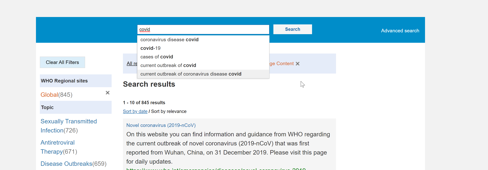
Then, the page reloads into a search list (like google), where there are more advanced search settings and filters you can use to clarify your query. At the top of the search results, a suggestion/warning is displayed when accidentally inputing a word/phrase with a typo. If you retype the same/or a different query int othe search bar on this page, it also features autosuggestions based on the word you're typing. I think it'd just be more straightforward to allow users to have these options in the first place when they first click on the magnifying glass, instead of only after they search something the first time. I think the intent of having a simplified first search popup was for convenience, but it may be even more convenient to redo the search having to adjust details a second time. If users just want things more open-ended, they can just ignore these settings to keep searching as is. 
   ##### Severity: 2

### 6. Recognition > Recall
Pages linked on the landing page either open a new tab or change the tab you're currently on. Those that open new tabs are helpful because you don't lose your place on the main page. *Some* of the linked pages generally feature a '<' symbol on the top left area to go back to the main page as well, so even if its loads over the page you're on, you can find your way back. However, this is not the case for all pages, so it would be helpful to enact this across the board.
   ##### Severity: 2

### 7. Flexibility + Effectivity of Use
At the top of the page, the site has several category bars that form an upside down 'L' around a latest updates videos. When you click on these, they open new tabs on your brower and each have their own subsections. With this setup, you'd have to click through all these bars to discover these subsections. It'd be better if users could hover over each bar and have the subsections appear to make the site navigation more streamlined for finding relevant information. This would increase efficiency for those seeking something specific and returning visitors who know where they want to go. 
   ##### Severity: 3

While the site does feature multiple ways to get to certain pages, I would say that how this is displayed seems less efficient for its use. Much of the 10 tabs at the top of the page reappear as links in the 4 listed categories at the bottom of the page, making it seem like there is more information than there really is since these lead to the same places. I suspect that maybe the intention was to make things accessible without having to scroll all the way up, but due to these labeled inconsistently (heuristic no.4), and the page itself not being that long, this doesn't seem to provide much improvement to user experience. 
   ##### Severity: 3

### 8. Aesthetics + Minimal Design
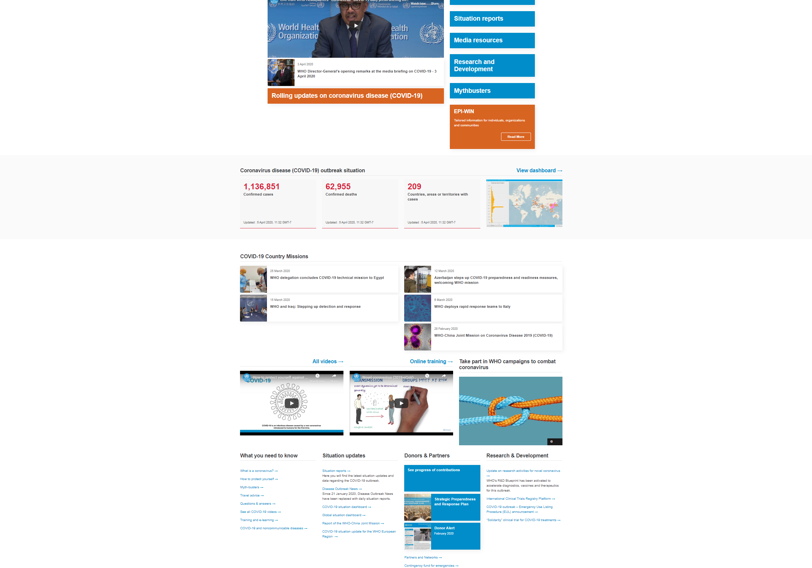
The landing page is a long scrolling site with various links to other pages on the site, imbedded videos, and articles. However, what I noticed as I scrolled through was the inconsistencies in how many 'columns' each subsection of the long scroll featured. It would fluctuate between having 3, then 2, then 4, then 2, then 3, then 4 side-by-side items (in that order), which makes everything look quite cluttered. Its easy to be overwhelmed with everything presented, and there is not much intuition as to a natural order of things. Your eyes seem to zigzag and dart across the page, instead of having a clear flow. The lack of symmetry due to the layout is also quite bothersome in an aesthetic sense. When you don't have the page fullscreen, or are viewing it on a mobile device, the site becomes a 1 column scroll through interface, with much of the other design elements carry over - this was much easier to use (and look at). 
   ##### Severity: 3

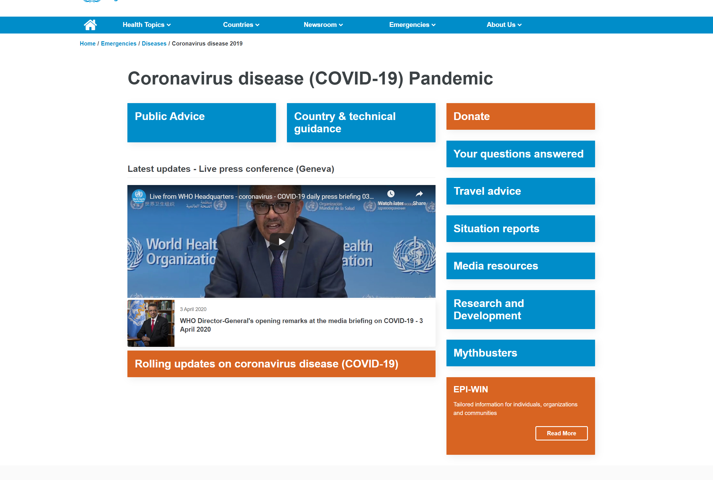
Also, the top of the page's category bars snake around a featured video, which seems to be prominently placed as it is the latest conference update from the WHO. It just makes little sense to me as to why they would format the bars in such way. It would be much more functional and essentials focused if there was a fully horizontal or fully vertical line of these boxes. 
   ##### Severity: 3

### 9. Helps Users Recognize/Diagnose/Recover from Errors
This site is meant to serve as an information resource, and evokes simple actions of clicking (pressing links and playing videos), so there is not much error they can 'cause'. 
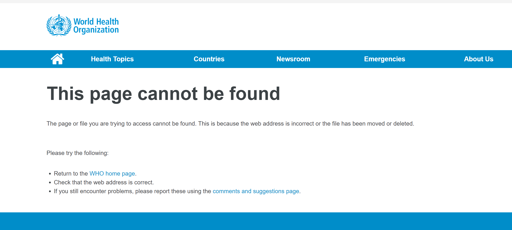
Upon testing the site's 404 error display, inspired by the provided past assignment 01s, the WHO does seem to have a designated 'This page cannot be found' protocol. It does express clearly that the user may have come across this error because "the web address is incorrect or the file has been moved or deleted," in this way, allowing them to recognize the problem and diagnose it. They also then prompt actionable solutions to return to the WHO homepage via hyperlink, double-check the URL entered, or report this issue through their suggestions page (also linked). Pretty straightforward and effective.
   ##### Severity: n/a - good as is

### 10. Help Documentation
There is not an explicit "help" area of the site, nor a shorthand guide as to where to find which resources, etc. This may come in handy due to the lack of natural flow to the site, per the confusing double inclusion of links and cluttered interface. However, this would not be less necessary given changes to the overall site. Otherwise, mistaken navigation with the 404 not found displays seem to cover most of the potentially needed help and the WHO generally having a suggestions page where one can file complaints is handy for potential improvement.
   ##### Severity: n/a - good as is

#### tl;dr: The WHO's coronavirus site is definitely information and holds much potential and utility. Much of its problems are centered on its lack of consistency across the site's interface features, which is can be bothersome and hinder the site's usefulness. I can only infer that some of these issues are due to prioritizing the site's launch, in order to provide the public with critical information from this trusted international agency as soon as possible. With that said, Jakob Nielsen's 10 heuristics can definitely do its part to improve the user experience of the numerous visitors it must receive.

## Site02: [CalJobs](https://www.caljobs.ca.gov/vosnet/Default.aspx)

### 1. Visibility of System Status

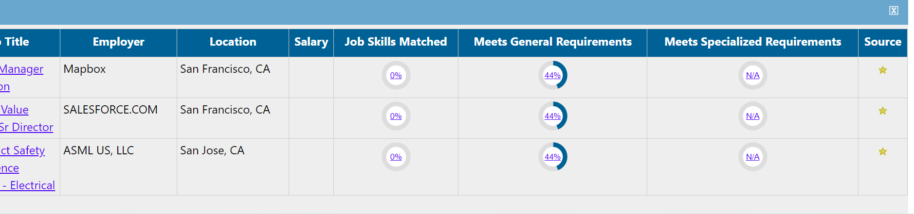
When a user makes an account, they enter their personal information and professional background to assess their qualifications for job roles. Upon doing so, saving certain listings enables one to see their particular level of fit. The system does well to give appropriate feedback by telling users how qualified they are for a certain position. 
##### Severity: n/a - good as is

However, what's not ideal is the site does not have a notification-style system for users to keep track of their messages, matched listings, etc. (like Facebook, for example) which leads to less management ability for the users. In terms of job searches, this can be a critical feature to have (or lack). 
##### Severity: 3

### 2. Match Between System + Real World

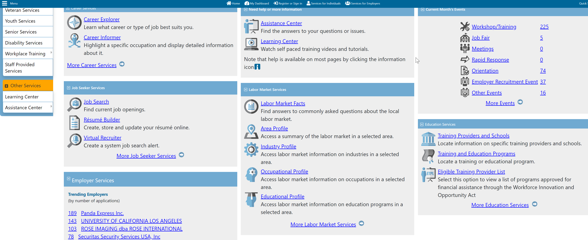
This site does, for the most part, use straightforward language on its descriptions. Different resources are named appropriately (ex. "Resume Builder" or "Veteran Services"), which make sense as to what they're trying to do.One part of the site, the Dashboard page, utilizes icons for their multitude of links, allowing users to both to scan through options more efficiently and break up text, as a recurring feature of the site is its overwhelming content/text. I would say, though, that it CalJobs could be improved if these visual cues were implimented throughout the site, as they are seldom present elsewhere. Particularly the side menu panel to the left of the screen, which appears across multiple pages, icons would be helpful to simplify its appearance, leading to the reduction of text descriptions to modernize it even with a more app-like feel. 
##### Severity: 3

### 3. User Control + Freedom
CalJobs needs much work to improve their application of this heuristic, as there is little in place to catch mistakes in terms of user input. The site itself does not have its own emergency exits in place, relying on the browser's back button to change states. In the job search feature, typos and invalid inputs do not prompt warnings or corrections. Most inconveniently, this is also the case in the forms one can enter their information to make an account or build a resume. There is no "save progress" option, meaning users have to finish the entire process in one sitting or otherwise start over if interupted, and there is also no "clear form" option to reset a page (you must refresh or go back/reclick). 

##### Severity: 3

### 4. Consistency + Standards

There is a great lack of internal consistency with the site's interface. Different pages of the site look very different from one another in terms of layout, colors/branding, and features. For example, the [Dashboard](https://www.caljobs.ca.gov/vosnet/dashboards/default.aspx?menuid=MENU_START_PAGE_DASHBOARD&pu=1&plang=E) page looks quite distinct from the landing site and the job search area. This lack of cohesion makes it a bit confusing to navigate the site as you are not always sure what to expect, and do not intuitively know where certain features may be located, making it also inefficient because there is somehwat of a "learning curve" towards utilizing what is intended to be a government-initiated public resource. 
##### Severity: 3

### 5. Error Prevention 

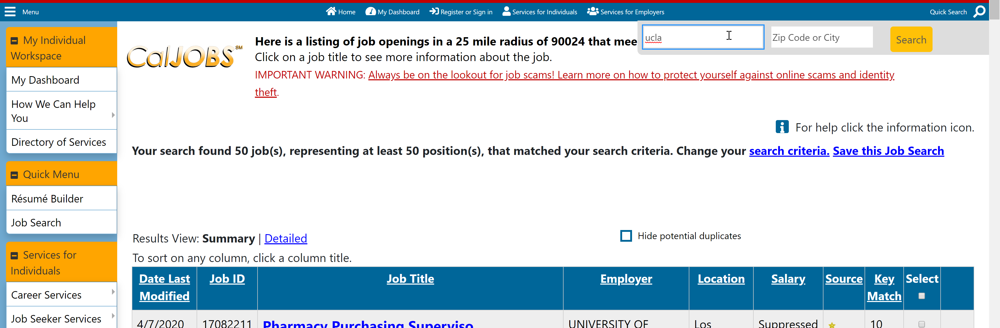
The search bar for the job search site poses minimal utility. It is not a built in feature within the page, which is inconvenient as the page's purpose is to search for something, but is located in the top right corner of the page with a magnifying glass (which does hold external consistency, per heuristic no. 4). Its features are limited: you search for key words and zipcodes or cities. Here, it is unclear how these jobs are organized, and, thus, it is likely a user is missing out on possible entries that may not appear in that particular query. 
##### Severity: 3

### 6. Recognition > Recall

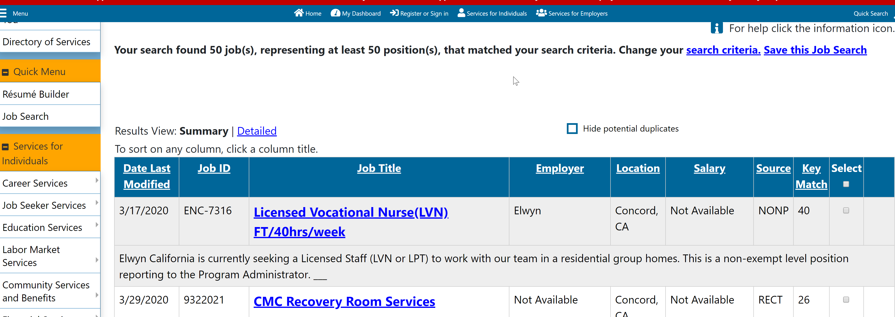
When looking at job listings, the information is presented in a long table that encompasses most of the page. Each column describes parts of the listing: date modified, job ID, employer, job title, etc.

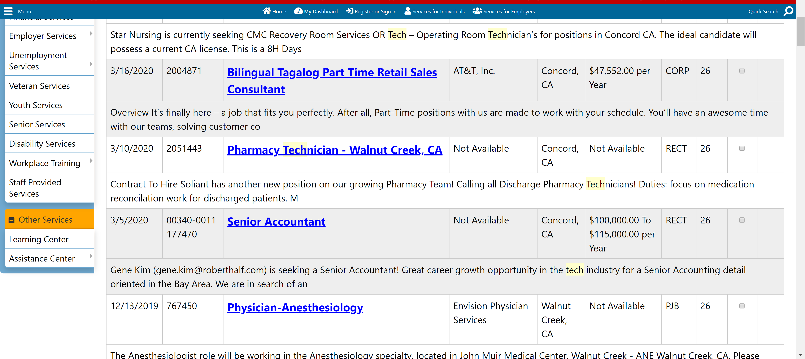
However, as you scroll down the page, the labels of each category disappears. This is problematic as the user has to constantly scroll back to the top to recall what the column is supposed to be about. While sometimes, you can get away with 'figuring it out' via contextual information (ex. month/day/year format --> indicative of the "Date Last Modified" info), sometimes the information is listed as "Not Available" (as seen in the "Salary", "Employer" columns most often). In general, it'd be best if the user doesn't have to infer this, it should just be available. 
##### Severity: 3

### 7. Flexibility + Effectivity of Use

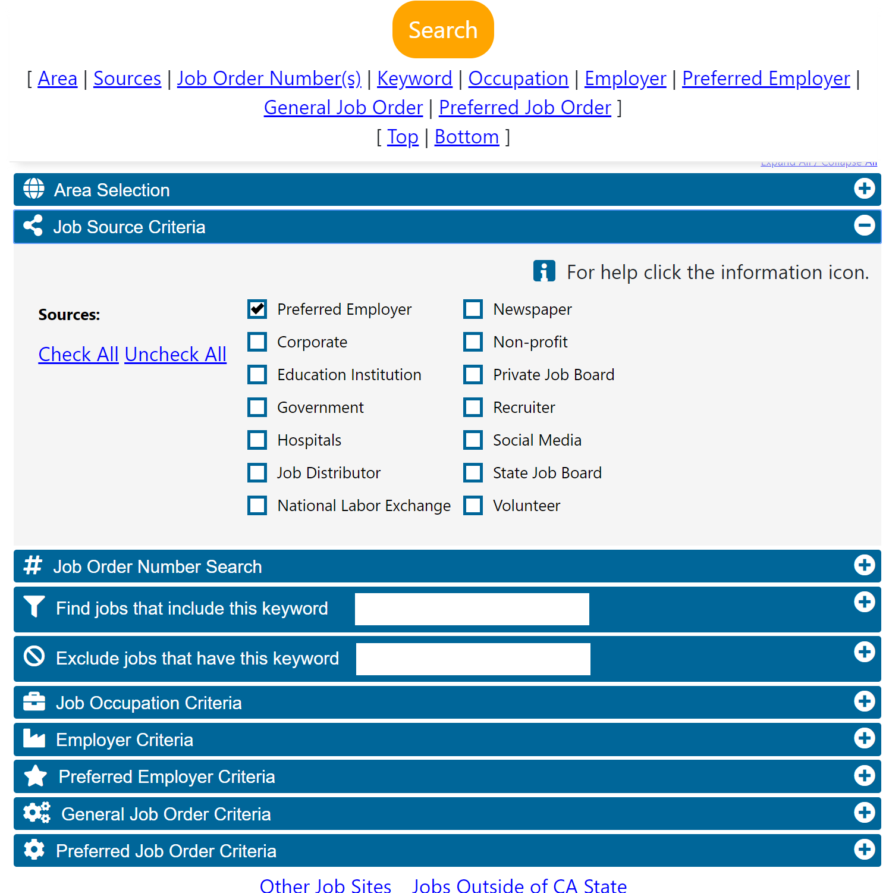
Exploring through the site, I discovered a more throrough job search form, in which there's various criteria one can select and specify to narrow down this search. In this way, this is a more flexible way to accomplish the same thing, enabling those who have more settled specifics in mind to carry out this process. I would say the general critique regards how hidden this feature, and, consequently, underutilized it may be, leading the majority to undergo a lower quality user experience.
##### Severity: 2

### 8. Aesthetics + Minimal Design

Overall, the web UI is extremely outdated and cluttered. Outright in the landing page, the buttons to "Find a Job", "Find a Candidate", and "Find an Office" do not fully display their text (only know what they say because text pops up as you hover over it). 
##### Severity: 3

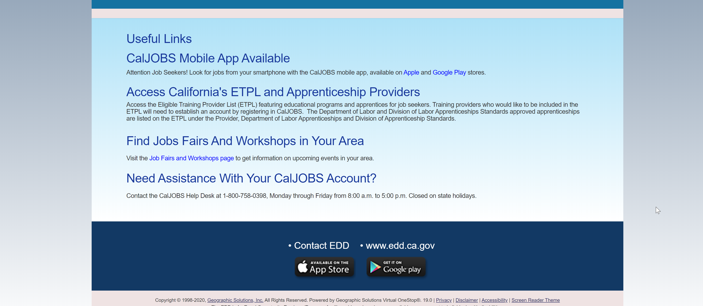
On the bottom half of the landing page, the display of links and resources is essentially a list: single column, linear, with little distinguishing features as to the hierarchy of information, no use of icons to simplify categorization, etc. 
##### Severity: 3 

As seen in heuristic 6's image of the job search page, there is definitely not apply minimal design, as it is cluttered with too much text all at once. There is little context as to the left tab's purpose in relation to job searching, as it is main menu of sorts for your account and various services. At the very least, this would be better as a horizontal bar at the top of the page, separated from the rest of the page as it draws attention away from the page's purpose of listing job openings. Regarding the job listings as well, there is much work to be done in simplifying its presentation: decreasing the sheer size of the charts and texts and placing clearer boundaries between description. As overwhelming as it is displayed now, this is apparently the summarized view -- the detailed view, though, does not provide much help as it essentially just combines various columns of the summarized chart. 
##### Severity: 3

### 9. Helps Users Recognize/Diagnose/Recover from Errors
The site displays the standard 404 error, with no actionable information as to how to circumnavigate this error. Again, with the site's search bar, there is also no spellcheck or format check, so you can misspell words or type long, random numbers for the zipcode, for example, and get no results instead of the system calling it to your attention. Users are left on their own to notice their mistakes, and use the back button of the browser (since none is built into the page) to backtrack. 
##### Severity: 3

### 10. Help Documentation
The site does feature a ["Forgot Password?"](https://www.caljobs.ca.gov/vosnet/Retrieval/SelectRetrievalOptions.aspx)  button clearly marked below the account login area. While it still looks rather basic, it does present decent, although improvable, documentation for troubleshooting during login. 
##### Severity: 1

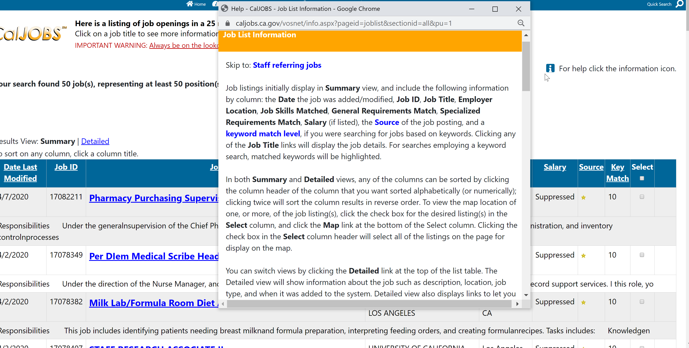
Meanwhile, on the job search page, there is an icon that reads "For help click the information icon," feature, which then causes a guide of sorts to appear as a popup window. First of, the icon's placement seems out of place, and it is ironic that the help icon, which ideally serves a minimalistic symbol to communicate its purpose, requires text explantion. However, due to the overload of information, it needs it to stick out to a user. The popup window itself details helpful instructions as to how to navigate the page and interact with the chart (selecting and saving listings), as well as definitions for certain terms. It provides thorough help, though its accessibility is lacking. It would be better if this existed as a page on its own, or was more integrated into the sites features (ex. hovering over certain areas explains its purpose).
##### Severity: 2

#### tl;dr: CalJobs is a public employment resource that has great intension, but haphazard execution. In many ways, it just seems that this site was established several years ago, and was "left behind" in terms of UX/UI developments over time. One can see while exploring the site that its different parts display different levels of updatedness. By applying these 10 heuristics, though, it can go about serving its purpose in a way that is more accessible and welcoming to job-seekers. With unemployment at an all-time high due to the current pandemic, it is critical we prepare resources such as this for the countless people who will need it. 
