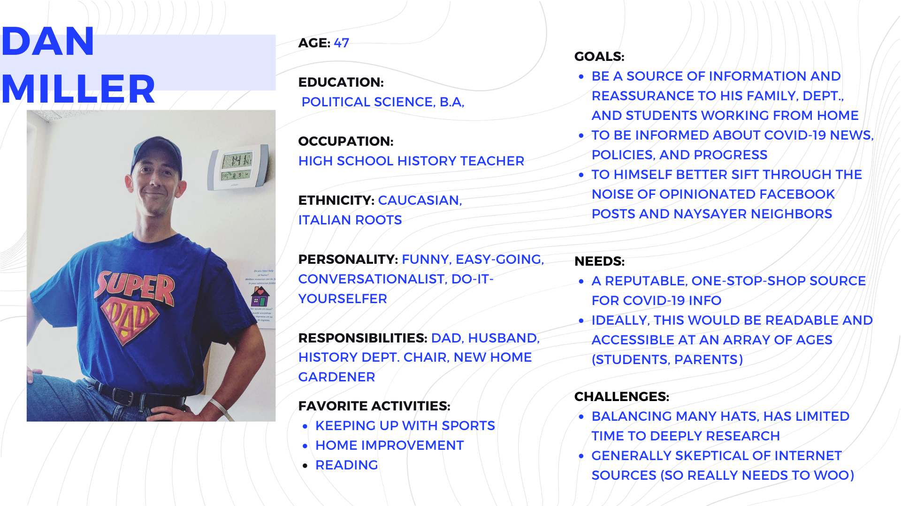
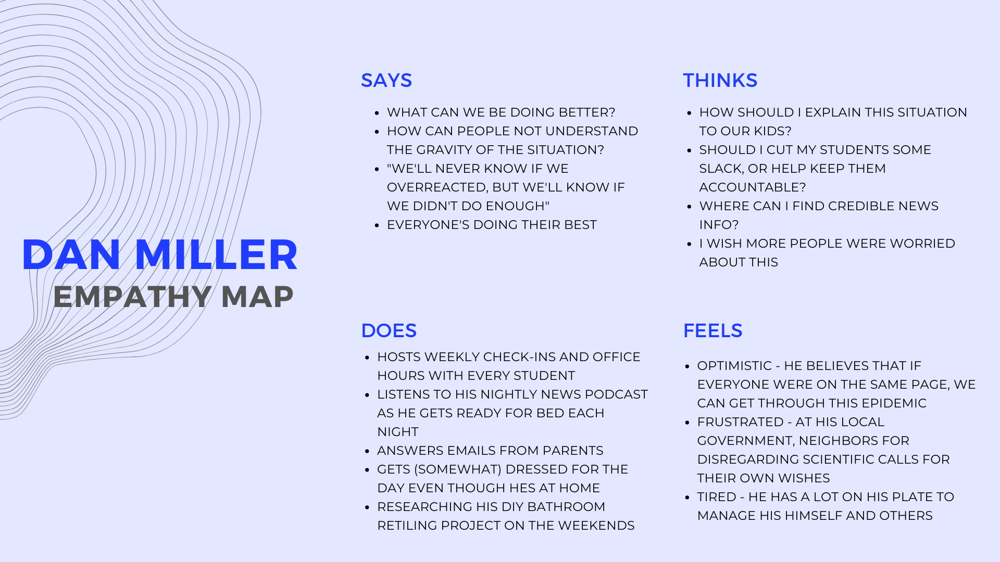
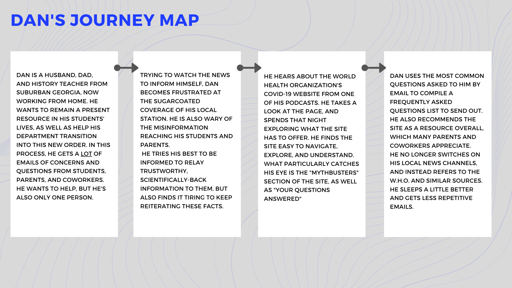
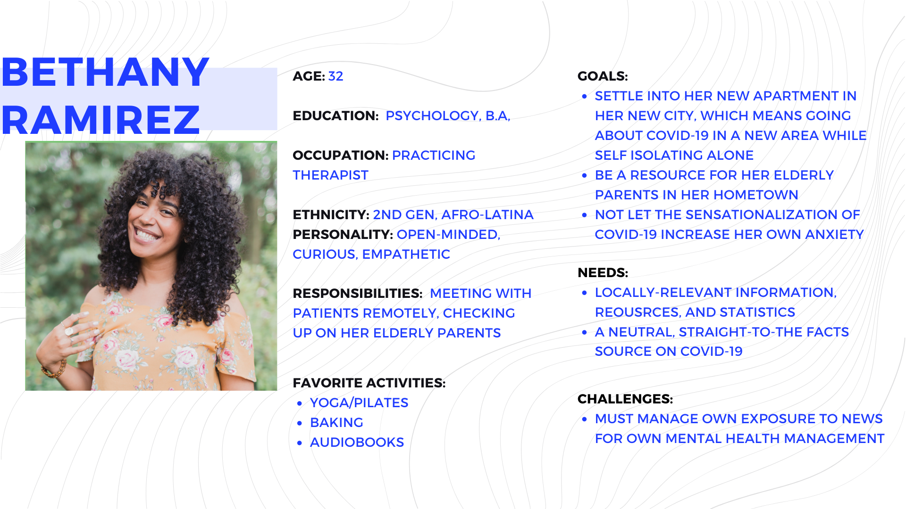
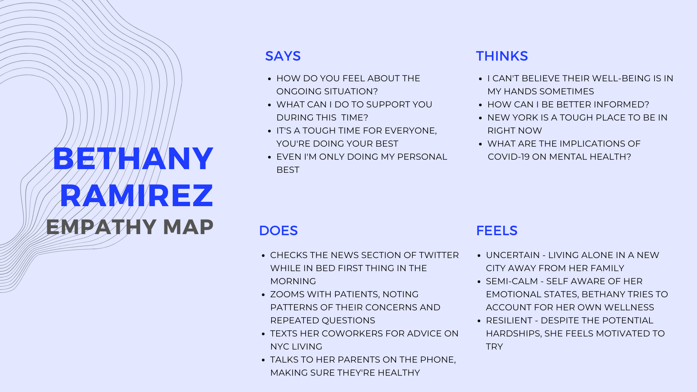
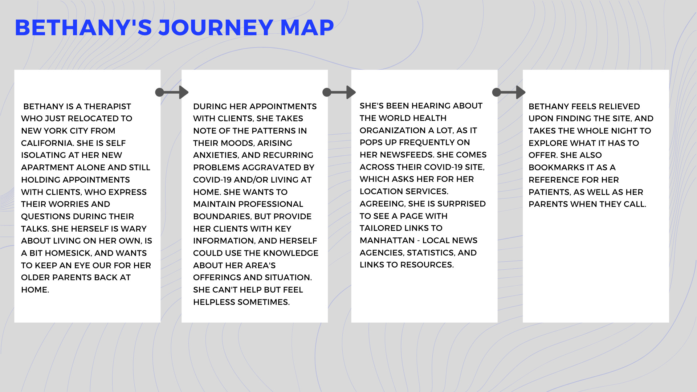
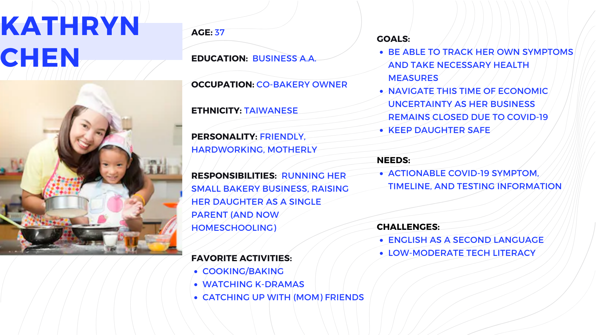
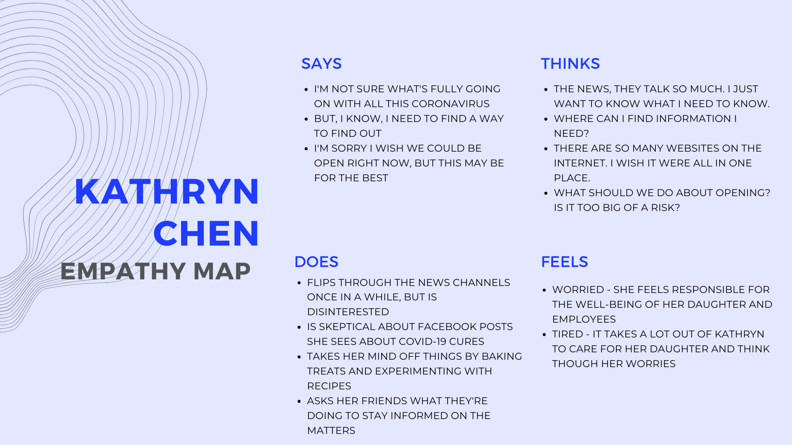
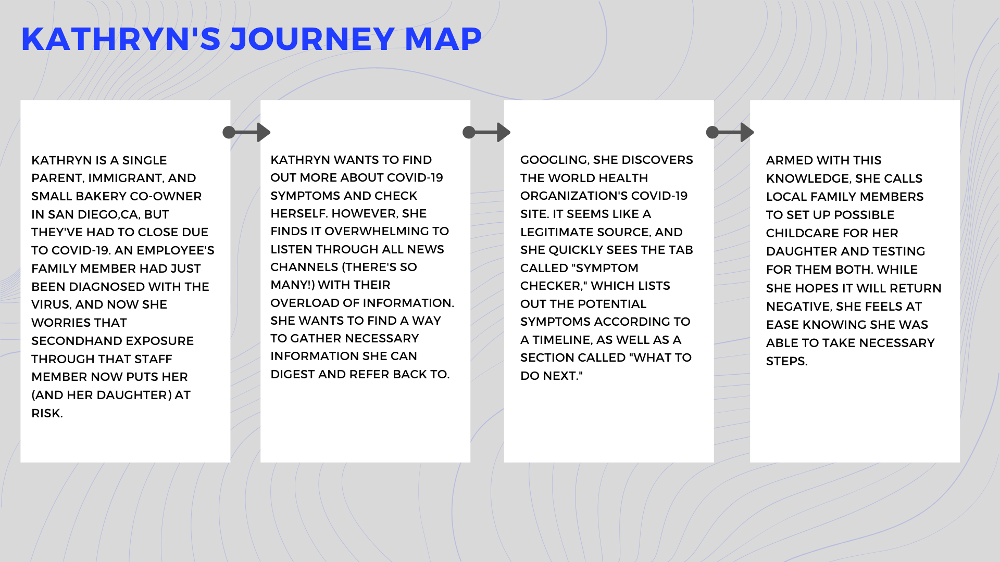

# Assignment05: PERSONA + SCENARIO
##### Anjenica (Nikki) Ramos
##### DH 150: User Experience Design, Spring 2020 - Prof. Cho

### Purpose of UX STORYTELLING
Prior user research enabled me, the designer, to learn basic needs of potential users from their behaviors. However, observing and testing only a small number of volunteers, this does not give a complete picture of the product's audience. My volunteer subjects may also hold particular quirks or personal preferences that do not generalize to the spectrum of users the product must account for. So, to further research, user experience storytelling will provide a way to consider other hypothetical users by building personas and stories, taking into account thei demographics, motivations, and mannerisms, which can all influence their interaction with the product. 
> Through UX storytelling, we are able to understand more vividly *why* various users may seek the product and *how* yjr product can be improved. We are also able to better consider design trade-offs to cater to multiple audiences, improve functionality, and design to meet their needs and goals, which designates the success of developing a product for public use. 

### Three features you want to design 
1. **A more organized tabular homepage** -- overall cleaning how the landing page is presented because clashing formats, colors, lacking of design heuristics makes the site slightly disfunctional and discouraging to use
2. **A Symptom checker/sickness protocol** -- there is currently not a section which focuses on COVID-19 symptoms, as well as action items for users to take if they think they may have COVID-19, how to get tested, when to seek help, etc.
3. **Geographically relevant links/resources** -- it'd be nice if the site can use your location information to have a section about local statistics, local resources, and local guidelines (ex. shelter in place regulations)

## Meet Dan

> **Scenario:** Dan is a husband, dad, and history teacher from suburban Georgia. An uplifting, motivated guy, he's trying his best to navigate his family, his students, and his department through the COVID-19 pandemic by relaying key information. He doesn't agree with a local leaders trying to open the state, but his word alone can only mean so much in comparison to an elected politician. He wants to find a reputable source to share with his coworkers, parents, and students, as he gets a lot of emailed questions, which range from wild to genuine concern. He's about as tech-savvy as the next guy, and can presume that those he'd share it with would need something informative, yet easy to navigate and understand.

## Meet Bethany

> **Scenario:** Bethany is a therapist who just relocated to New York City in January, two months before COVID-19 became rampant in her area. As she works from home, she holds some wory about this adjustment period in her life in regards to her own mental health, her clients', and her elderly parents (who call frequently about concerning headlines they see!). As she is new to the area, she is unaware of all the particular resources available to her, and is confused about the fluctuating numbers she sees in news reports. (Could it really be that bad?) It's a bit frustrating to navigate this uncertain situation in an unfamiliar area, which makes her feel helpless even though it's also her job to help others through this time. 

## Meet Kathryn

> **Scenario:** Kathryn is a single parent, immigrant, and small business owner down at San Diego. They recently had to close temporarily due to COVID-19 precautions, as she wants to make sure she takes proper steps for her staff and her young daughter. Lately, she has been stressed out and feeling extra fatigued due to the strain of worrying about her business, as well as caring for her child at home. An employee calls her to say that their mother, a nurse, had just tested positive for the virus and that they are now getting tested. She warns Kathryn that, if they may be exposed, she may also have through their interactions. Before she erupts in worry, Kathryn would like a convenient way to inform herself of potential symptoms.

