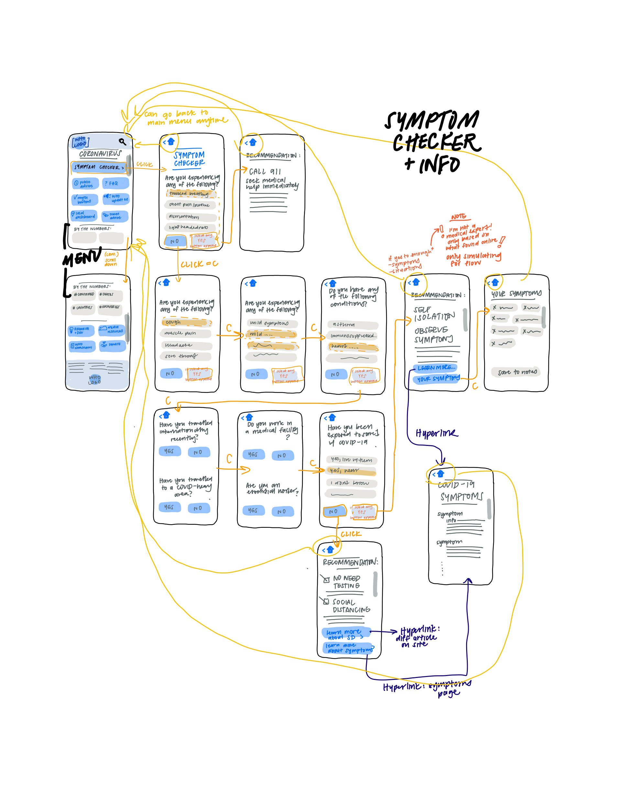
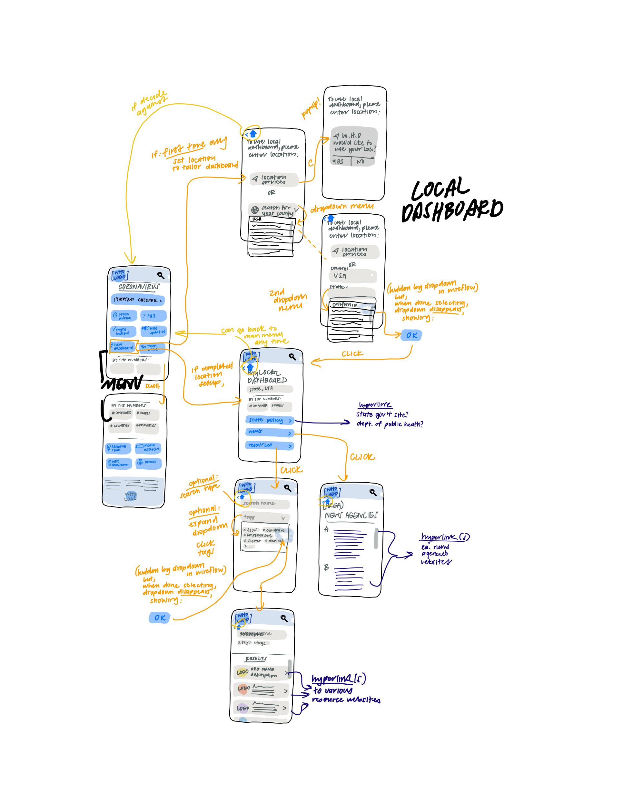

# Assignment06: Low-Fidelity Prototype
##### Anjenica (Nikki) Ramos
##### DH 150: User Experience Design, Spring 2020 - Prof. Cho

## Project Overview: W.H.O. Covid-19 site 
The World Health Organization is a trusted international health agency which coordinates health efforts within countries of the United Nations, and, thus, currently serves as a leading source towards COVID-19 initiatives. This project will povide insight towards improving the presnetation of the information and navigation on their COVID-19 site, which features factual basics, advice and resources, as well as regularly updated regulations and statistics of the ongoing pandemic for the public. Prior user research with site testing and interviews have revealed problems in the current website's interface structure, as well as a lack of key, actionable resources, such as COVID-19 information that pertain to a user's location and a symptom-checker. 

Through the creations of personas and scenarios, I was able to explore these problems further, and my work thusfar has led me to design the following features in a mobile version of the site: 
1. **A more organized tabular homepage** -- overall cleaning how the landing page is presented because clashing formats, colors, lacking of design heuristics makes the site slightly disfunctional and discouraging to use
> For this, I imagined a 47-year old father, teacher, and department chair, Dan Miller, whom many in his network reply on for guidance and reliable information. This largely follows the high, yet everyday stakes that come with seeking COVID-19 info, as users need well-designed resources to be able to understand the details themselves (minimalist organization and communication), be able to refer back to this time and time again (where credibility and memorability come into play), and this resource to others (i.e. intuition for a broad, public audience). 

3. **Local links/resources** -- it'd be nice if the site can use your location information to have a section about local statistics, local resources, and local guidelines (ex. shelter in place regulations)
> For this feature, I pictured a work-from-home milennial user, Bethany Ramirez, who has just relocated to a new area for work. They are tech-savvy enough to seek information from the internet, and particularly need guidance in navigating the pandemic while settling in an area whose local sanctions, resources, and statistics are unfamiliar to them. While one could scower the internet and numerous unkwnown organizations' websites and news agencies, it'd be nice to have these all featured, or vetted and linked. This benefits multiple parties by connecting users to local offerings and them to their target audience.  

2. **A Symptom checker/sickness protocol** -- there is currently not a section which focuses on COVID-19 symptoms, as well as action items for users to take if they think they may have COVID-19, how to get tested, when to seek help, etc.
> Here, I envisioned Kathryn Chen, a small business-owner and single parent for whom English is not their first language. In a situation where she may have been exposed to the coronavirus, she needs key symptom information to take necessary steps for her health as well as planning childcare for her daughter. This addresses such a critical situation with trustworthy action steps, which is especially key in an internet full of pseudoscience remedies and varying experiences. 

Now, through low-fidelity prototyping, I can begin bringing these ideas to life. Through drafting user interface designs and creating a workflow of users' interactions with the mobile site, I am able to translate the research insights to a (rough!) product. From here, testing is key to see designs in action and gather feedback for improvement. It is always important to consult participants to understand design shortcomings from outside perspectives that the designer may be blind to. From here, we can then refine designs to continue with the product's development. 

## Prototype 

### Tasks:
This low-fidelity prototype features, which have features within their sections: 
1. redesigned tabular landing page
   - mobile friendly 
   - hierarchical organization based on relevance 
   - usage of icons / descriptive labeling 
2. symptom checker (survey)
   - track selected symptoms
   - provide recommendations/action items based on results
   - ability to learn more with general symptom info directory 
3. local dashboard 
   - set location services/area 
   - have a tailored dashboard to user's area
   - links to local government sites
   - database of local resources + search navigation
   - database of local news agenices + search 
etc:
   - accessibility: avoidance of typing (unless search), scroll/click based
   - colors not strict, just to distinguish options from buttons!
   
### Wireframes/Wireflow (original)
note: view/save-able versions are [*here*](https://drive.google.com/drive/folders/1321mlnP-ATo8WMRQbyc56xphFG0HGX6K?usp=sharing)

### User Testing 
User tested the originally drafted low-fidelity prototype on the tasks and features presented. Their interactions/writing was recorded 
video of UT session [*here*]()

![wireflow of UT local dashboard()

Explain to the person what the system is supposed to do. After that, ask the person to use the prototype to complete each of the tasks you designed, one at a time, without telling the tester how to do it. As the tester taps on the various controls in the prototype, the interaction flow should visually guide the change of the prototype’s state to show the system’s response. It might be a good idea to ask the tester to use a highlighter to follow the interaction points(ex. buttons) and the flow to the next wireframe. 

- Note the tester’s confusion or unexpected interaction
- Note whether the tester could successfully complete the tasks 
- Note when the tester gets confused, side-tracked, or stuck in a state s/he can’t get out of.
- Note if the tester tries to do something in a way that’s different than how you designed the functionality to work.
- Note if s/he is able to complete the test tasks successfully.

### Reflections

To summarize my process, I initially reviewed my existing user research thusfar to gather key findings: what flaws were most prevalent in the existing site, how users interacted with the site (positively and negatively), users' behaviors and values, and missing feautures that may prove useful. Then, I turned these specific insights into tasks and features I wanted my prototypes to test. I originally created a rough verbal/note tree map to create a foundation for wireframes. In drawing the wireframes, I sought after a mobile-friendly, intuitive, minimalist design in how I presented buttons/options. Afterwards, I established the flow by clarifying the interaction points and each step/screen. I'd say this part went generally smoothly, as it builds on previous weeks' learning and helped me come in with a thought process in mind. It did take longer than antiicipated though, partly because I didn't realize just how much thinking goes into planning out something app/site features: every button, all the order, so much hypothetical thinking (kudos to developers out there). I also did get pretty into it and lost track of time once I got going. 

For user testing, I had the participant try to go about the steps of flow with their own intuition. The only thing I would note is that I did make little border marks (grey boxes) on their sheet as a basic guide to avoid confusion with the layout of the wireframes just because I didn't draw it out strictly linear and that may be confusing in a way that's just counterproductive - I hope that doesn't interfere too much? In regards to their trial and its outcomes

- what went smoothly
- what didn't / differed from expectations

what you would change or design differently based on the feedback you got from the prototype testing. 
- wat problem the tester encountered
- sentence or two how you would address the problem if you were to revise the prototype.

Based on this feedback, I noticed:
- key problem 1
> solution suggestion 1
- key problem 2
> solution suggestion 2 

