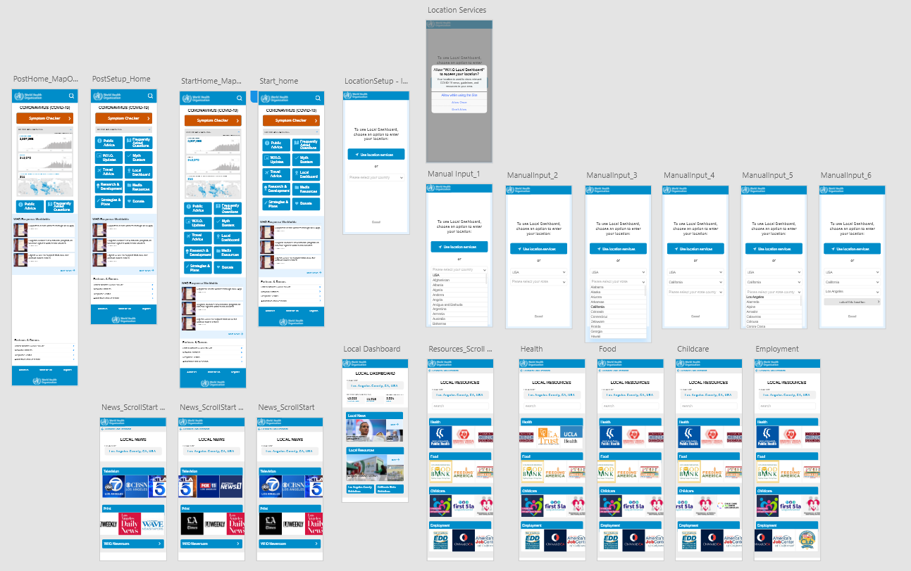
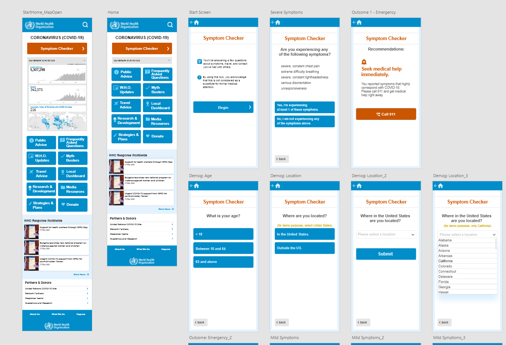
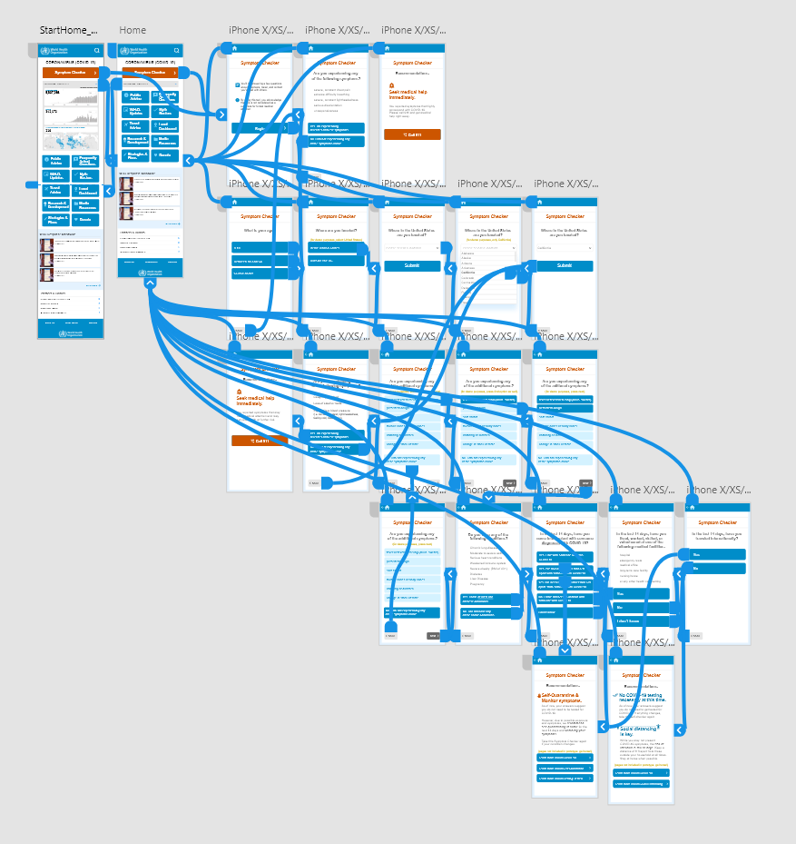
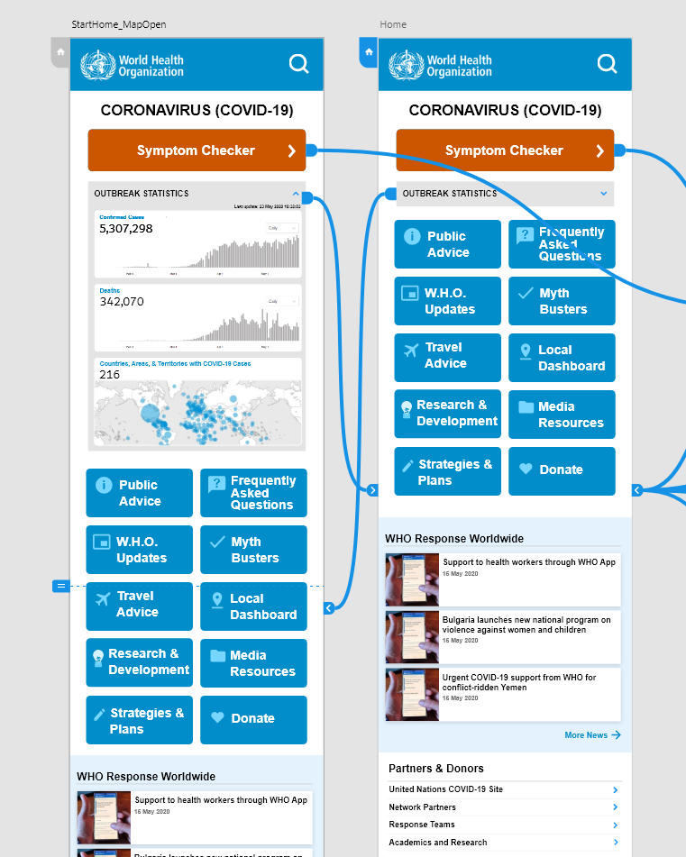
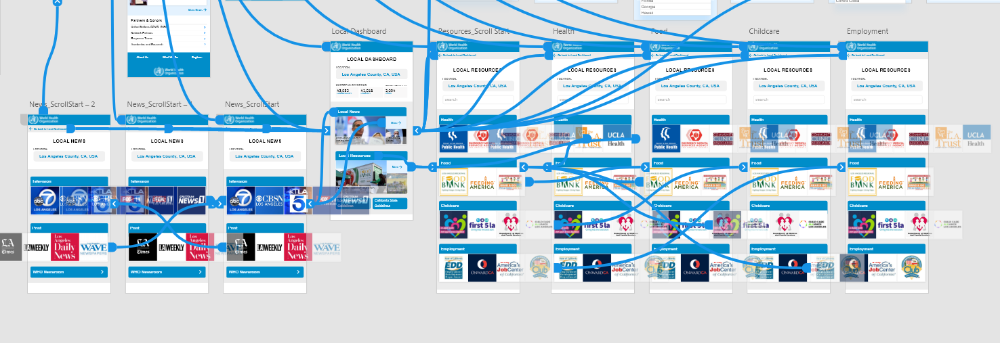
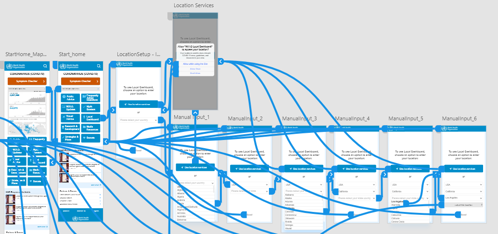
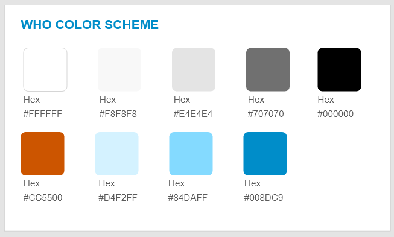
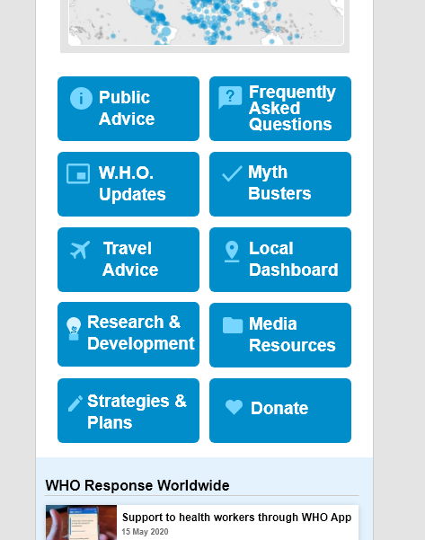
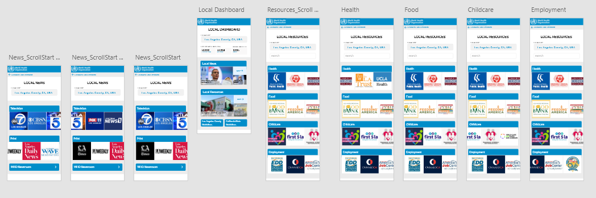

# Assignment07: HIGH-FIDELITY PROTOTYPE
##### Anjenica (Nikki) Ramos
##### DH 150: User Experience Design, Spring 2020 - Prof. Cho

### Project Overview
My project involves an improvement and expansion of the existing World Health Organization COVID-19 resource website. Here, I use a high-fidelity prototype to demonstrate additional features and reinvisioned site interface design. A high-fidelity prototype serves to materialize the insights of user research and designer solutions by being an interactive sample of (nearly) the product in action. With a more concrete model, we are able to demonstrate ideas in mind and test the prototype itself, which can bring to light more potential insights from firsthand experience. 

#### Representative Screens
Just as an overview sample of the prototype~

### Tasks + Diagram/Wireflow

Here are the following tasks the prototype supports + the interaction sequences with screen designs

1) **COVID-19 Symptom Checker:** While offering information about the Coronavirus, the WHO does not have a more direct way for users to apply symptom information in real life. In addition to knowing about symptoms for common knowledge, users may be reading to compare what they may feel themselves. To make this more feasible, the Symptom Checker will use user demographics, situation (living situation, health care work, travel), pre-existing conditions, and COVID-19 symptoms to assess users' risks, give action items, and further reading resources. 

2) **Hideable Worldwide statistics:** An eye-catching feature of the WHO site is their presentation of worldwide COVID-19 cases and deaths, as well as the countries affected. Currently, this is just shown numerically, but links to another site of theirs dedicated to this. While this is interesting and frequently reported on the news, this can be overwhelming for some. So, making it as a show/hide function can remove it from view. In addition, providing it as a chart as opposed to just the values can contextualize the situation more for those who want to know.

3) **Local dashboard:** This is a new section that allows users to get more localized news, information, and resources, which was determined to be valuable from prior research feedback. While the WHO is in the business of generalized information of worldwide coverage, it would be helpful for them as a trusted source to connect users with the existing sources in their area. This dashboard provides a hub of sorts that shows news by media type and resource by focus in a graphical manner (since people are more likely to recognize logos than lists), and (in action, but can't be shown in the prototype) hyperlinks out to those agencies and organizations' sites. 

4) **Setting location:** To have a 'functional' (mocked here for prototype purposes) Local Dash, one would need to input their location. This can be done through using your phone's location services with permission, or manual user input (mocked here for protoype purposes). This would be a one-time setup, which then users can refer back to or change if they were to change places as well.  

### Graphic Design + User Interface 
For the graphic elements of the site, I decided to build from the WHO's existing site and their branding, which is rather consistent and modern enough already, as it is something users would realistically expect if this site improvement were to replace the current one. 
- The wHO's main colors itself are the #008DC9 blue-teal and #FFFFFF white, with black text and an occasional complementary #CC5500 burnt-orange sprinkled for high-priority attention-grabbing. From here, I started playing with colors, adding more muted tints of the light blues and greys to add some variety in the interface backdrop and buttons, but still be monochromatic and not clashing. 

- For much of the text, the color is actually a dark grey as opposed to black, to keep with the advice learned from class as to not be straining to the eye. I also stuck with the same Arial and other sans serif variations to follow WHO branding and also be more sleek and readable. 
- Clickable buttons follow from the site, but placed in a 2-column and includes icons for some design heuristics application. Much of the old site was largely text based, so this is just a way to break up space and be visually appealing as well.
- For the interface, I stuck to a 1-2 column max display to save space where possible and show a more, but not overwhelming, amount of information/clickable options, without being overwhelming. A critique from the orignal site from design heuristics was the lack of consistency for its format between pages and as you scrolled down. THere, I aimed at correcting this to make the site more inviting and also more intuitive since similar actions and structures follow between sections. 

- For the Local Dashboard news and resources pages, I opted for carousels to simplify presentation (as opposed to listed hyperlinks to be scrolled down. I found this to be more appealing in regards to categorizing what I wanted to display (thought process: should I list things alphabetically? by area? how would I note they belong to x y z category without having too many nested pages?). I found it was much more ideal to present resources horizontally to swipe through, and with recognizable logos as opposed to a page full of Arial text. 

###### Note: I designed this as a mobile site that can be searched on the go, but I also did so with the logic of whatever works (fits/is feasible) to present on a phone can definitely be possible on the desktop. I imagine a desktop site largely following the same formats, with just some widening to accomodate for the landscape dimensions. I decided to work backwards as the original side was not mobile friendly. 

### Accessibility
To test color contrast, I used the Stark Adobe XD Plugin. To gauge the entire prototype's AA level accessibility efficiently, I tested the areas of text and colors that were the smallest or the least visually contrasted. If these bits passed, then the other elements would surely do so. I did find that I had to change some of the original colors I began using, as I just experimented with the color grabber tool to choose them. 

 

### Interactive Prototype:

Original prototypes can be found through these links: [symptom checker + pandemic statistics](https://xd.adobe.com/view/0547c6dc-fd59-455f-7a88-bd32df81b683-7376/) and [local dash + location settings](https://xd.adobe.com/view/b3b24d0e-ca6a-402f-60f6-39a6c879065c-c583/screen/af9be4a0-4e0f-446d-ac5b-c6cacef46bf4/Local-Dashboard?fullscreen&hints=off)

### Impression Test

The screen recording of the impression test can be found [here](https://drive.google.com/file/d/16uhN341RfDzPlGw9BdLcVndHN3w2jbCh/view?usp=sharing). 

Findings + Potential Changes 
For the most part, the prototype was functional and clear, so I'm generally not going to dwell on that. The participant reiterated some things what were noted in how I designed it, and was able to go through the tasks.

**consistent home button**
> For checking that there wasn't a dead end at the Local Dashboard, the participant hesitated at pressing the WHO, which was the 'home button' to go back to the landing page. I think it was unclear because in the previous task, which was separate, a home button was indicated with a house and arrow. They noted that, for the sake of consistency, to just have one throughout. I definitely just didn't think this one through, as I originally chose the home symbol, but thought it'd be nice to hace a sense of officialness to the local pages by having the logo present throughout. So, I'll definitely play around with both to see which one fits best. 

**Bigger font for the statistics** 
> While the participant didn't comment on this verbally, I noticed that the physically moved closer to the screen in trying to read the labels of the global outbreak statistics and the local statistics in the Local Dash section. So, this still needs to be improved either color wise or size wise despite technically passing guidelines. 

-**Centering text labels for local resources/too much blank space** 
> In the Local Dashboard's resource section, the participant suggested reordering the presentation of the resources and also changing the category labels to be bigger and centered due to the blank space it in the wide banner. This wasn't the caase for the general Dashboard, as those labels were two worded and are just longer, but these ones do look more tucked in one side area when it could be more prominent. 

### In-Class Cognitive Walkthrough
Here is the feedback I received from 3 other classmates during our cognitive walkthrough and critique, based on what was written in the form submitted (shorthand) and then a brief summary of our verbal exchange.

Any other comments?	
> ***Not too busy, not too overwhelming, professional.*** I also included the URL of the current WHO site so they were able to go on it and compare and they did find them to allign with one another. It was actually one of their comments that noted this is good because users would need to transition from one site to another and they should be alike in a way that keeps people comfortable. This resonated with me and I kept that in mind as I especially built on new features. I kept thinking what this would be like to a user who may have been familiar/primed by their experience of the old site - would they trust it still? would it be intuitive to follow?

Do you think the users can understand what this screen is about?
> ***understandable, yes, it's clearly labeled*** They noted how it's a clear heading in each place, but that maybe it can be 'jazzed up' more decoratively or outlined in some way. They did agree that I'd need a way to make the screen's name stand out, but not be too big and take up limited space.

Do you think the users can recognize this (interaction point/ information)?	
> ***clear where you have to click, but yes/no buttons might be too similar/mistaken with other buttons*** The points of interaction were clear, but that buttons of opposing options may look too alike to the listed options in the symptom checker, so that they can be pressed wrong. We briefly talked about how colors and placement may play a role. This led me to ultimately increase the space between listed options and buttons, as well as write out the explanations for yes/no meanings to be more explicit. 

Do you think the users can feel that the progress is being made toward what they want to achieve?	
> ***I think it'd be good to have a progress bar.*** While their feedback did cause me to consider adding a progress bar for the symptom checker, I decided against it logistically because of the varying directions a user's answers can lead them. The more extreme the case, the shorter it is because I asked for the more pressing symptoms first. So, not everyone taking it experiences the same set of questions, actually. But this sense of 'keeping track of where you are' and not being too deep into scrolling or nested pages stayed with me. As I revised pages, I thought of whether things needed to be presented a certain way - why a list? why 1 column or 2? can you retrace your steps to get back here? 

Is there anything inconsistent, missing, or confusing?
> ***back button, inconsistencies between making things centered or left leaning.*** I had home buttons, but was missing a back button for the symptom tracker, and how to just get back to the Local Dashboard from the pages within it. I asked if they thought it'd be useful, since I originally worried people would change their answers to not seem as sick, but then my groupmembers pointed out that's a personal choice with their consequences, but that it'd be more of an annoyance to accidentally make a mistake and have to restart. Also, it was noted to me that I should be more consistent with making text or button labels centered or alligned to the left side r to have a convention. So, for the pages' formats, things were centered if they were important information like headers, but left leaning if they were lists or if I wanted someone to start left-to-right while scanning like the carousel. Buttons similarly, centered ones are just like single-instructions like 'Begin' or 'Submit', while those with explanations are left-alligned. 

Any other comments?
> ***orange = emergency color, use as attention grabbers but don't overdo it.*** Piggybacking on another groupmembers' prototype which had some clashing colors, I got asked why I chose orange in some areas. I told them how it was already something on the site, and they said it's nice to draw attention, but sometimes does give off this sense of an emergency. I was told it's good for the symptom tracker and maybe ~if~ the advice is to get help, but describing the non-emergency recommendations as orange (which I originally did just for consistency, not even thinking of this) seems contradictory and uncessarily alarming. I asked if they think it should be anywhere else in the site, as the original site had orange scattered, they said no because it might lose its effect and/or be confused as a general brand color, which it's not. I asked if they thought red or yellow was better, they said no because red looks unflattering with the teal and yellow may present problems with readability, which I agreed. 

### Reflection:

I really enjoyed making the high-fidelity prototype! I felt it exciting to see your ideas manifest, but also found it really helpful to do the prior weeks' research and also the low-fidelity sketch to outline things instead of starting from scratch. Being most excited about the 'making' aspect of anything creative, my first instinct is to jump right into things, but this class has generally taught me the importance of proper setup. While this did take 1.5 weeks to make, it was not frustrating because I wasn't trying to conduct multiple steps at once (i.e. thinking about what users want, comparing the existing design with heuristics, testing it myself a billion times). I was able to have a clear aim having refined my project over the last couple weeks, and now was just about bringing it to life. 

This went smoothly in a sense that I literally learned Adobe XD last week, and that I'm astonished I was able to develop it this far with just practicing and looking up youtube tutorials. What I thought could be done in about 1-2 sittings really took hours upon each step because of the learning curve that just comes with the system, but, even in this single span of time, I feel like it was easy to pick up overall. I definitely underestimated the time it would take to make thorough decisions based on the feedback I received and that I definitely need to adjust my screen's brightness levels (lol). It also took quite some time to gather the real resources and news sources I wanted to feature in my Local Dashobard section -- I actually researched all those places and wanted it to appear legitimate. I discussed that too in my cognitive walkthough with my classmates, about the extra step of adding content to our prototypes that required research and formating. Will definitely learn to account for that in time management.

From what I've learned here, I have made some changes. For one, I increased some text sizes, especially at the statistics area, to be more readable -- I also made the color convention the same for both (before the blue/grey were switched). They now don't just *barely* AA guidelines and are more clear. I also changed some labeling, the home button to the home symbol for the Local Dash areas, and rearranged the carousels.

These changes are reflected in these prototypes: [symptom checker + pandemic statisticsv2](https://xd.adobe.com/view/0547c6dc-fd59-455f-7a88-bd32df81b683-7376/?fullscreen) and [local dash + location settingsv2](https://xd.adobe.com/view/b3b24d0e-ca6a-402f-60f6-39a6c879065c-c583/?fullscreen)

Moving forward, I'd also like to improve on the general presentation of the prototype in terms of animation skills., It'd be nice to to have buttons change colors when something is selected across the prototype, that way users have a better sense of what they're doing as regular feedback, as opposed to the screen just changing. I'd play around with how to make dropdowns and dragging motions more realistic. I'd also like to learn how to make effects like an opaqueness over pictures if you press or hover on it, or have a scrollable dropdown menu (if that's even possible).
